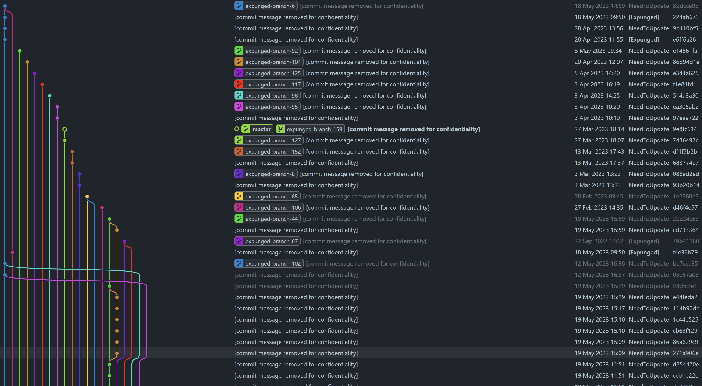

# Confidential Cloner

This Python script allows you to clone a Git repository, anonymizing all data while keeping the commit history intact. The script replaces all file content, commit messages, author names, author emails, branch names, and tag names, except
for a specified author's name and email.

This could be useful for maintaining your nice green boxes on GitHub, while keeping the actual work confidential.

This was mostly created because github does not keep your git history when you leave an organization. Hopefully they can add that in the future and make this script obsolete. I just like the color green.

## Disclaimer

You should check with your project owner/employer/employment contract if this is allowed.

Before you use the script, make sure you have a backup of your important data and understand what the script does. Please note that the script deletes the contents of the destination directory if it exists.

The creator of this script and the contributors to this project are not responsible for any damage, data loss, or any other negative consequences that may occur as a result of using this script.

This script is intended for educational and informational purposes, and it's your responsibility to use it in accordance with all applicable laws and regulations.

Remember that violating other people's privacy or intellectual property rights is not only against the law but also against the principles of open-source and mutual respect in the developer community.

This script also will only work with smaller, <3000 commit repos. Any larger and upload times could get really time consuming.

## Features

- Anonymizes author names and emails (except for one specified author)
- Replaces all file content with commit hashes
- Anonymizes branch and tag names
- Anonymizes commit messages
- Preserves commit dates and parents, so the commit graph remains the same

## Example of new history created



---

## Installation

Clone this repository and navigate into it:

```bash
git clone https://github.com/NeedToUpdate/git-confidential-cloner.git
cd git-confidential-cloner
```

It's recommended to use a virtual environment to isolate your Python dependencies:

```bash
python3 -m venv venv
source venv/bin/activate  # On Windows use `venv\Scripts\activate`
```

Then, install the required dependencies (`tqdm` and `gitpython`):

```bash
pip install -r requirements.txt
```

## Usage

You can run the script using the following command:

```bash
python clone.py -s /path/to/source -d /path/to/destination -n "Your Name" -e "Your Email"
```

### Arguments

- `--source`: Path to the source repository (required)
- `--dest`: Path to the destination repository (required)
- `--author_name`: Author name to be preserved (required)
- `--author_email`: Author email to be preserved (required)
- `--replace_name`: Replacement for other author names (optional)
- `--replace_email`: Replacement for other author emails (optional)
- `--expunged_name`: The name set to everyone else in the repo (optional, default: "[Expunged]")
- `--expunged_email`: The email set to everyone else in the repo (optional, default: "expunged@email.com")
- `--expunged_commit`: The message set for every commit (optional, default: "[commit message removed for confidentiality]")
- `--expunged_branch`: The branch name prefix, each branch will end with its index number (optional, default: "expunged-branch-")
- `--expunged_tag`: The tag name prefix, each tag will end with its index number (optional, default: "expunged-tag-")

---

## License

This project is licensed under the terms of the MIT license.

---
